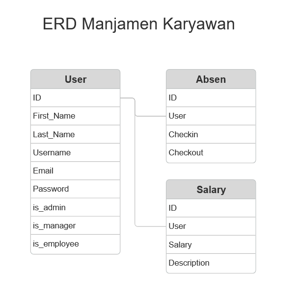

# Tugas UTS Server Site Programing

Aplikasi yang saya buat untuk pengelolaan karyawan dengan 3 role user yang berbeda, terdapat admin yang dapat mengelola manajer dan karyawan, manajer bertugas sebagai pengelola karyawan, karyawan hanya dapat absen pada Aplikasi


### ERD


Terdapat 3 table dalam Projek ini

- User
- Absen
- Salary

## Fitur

- Login
- Absen
- CRUD manajer
- CRUD karyawan
- Penggajian by karyawan


## Teknologi yang digunakan

**Client:** React + Vite, Boostrap 5

**Server:** Python


## Menjalankan Server

Unduh project
```bash
  git clone https://github.com/khusniridh0/python-project.git
```

Masuk ke dalam project
```bash
  cd core
```

Install dependencies
```bash
  pip Install -r requirement.txt
```

Migrasi database
```bash
  python manage.py makemigrations
```

```bash
  python manage.py migrate
```

Jalankan Server
```bash
  python manage.py runserver
```

## Menjalankan Client

Masuk ke dalam project
```bash
  cd client
```

Install dependencies
```bash
  npm install
```

Jalankan client
```bash
  npm run dev
```
## Kesimpulan

Project ini saya buat untuk pengembangan awal dari pengelolaan karyawan yang lebih baik dapat di sesuaikan dengan permintaan perusahaan / sekolah atau pun instansi lain. dengan ini penerima dapat melihat demo dan memiliki rancangan dasar dari pengembangan sistem informasi yang akan datang. penerima juga dapat berkontribusi dalam pengembangan.
